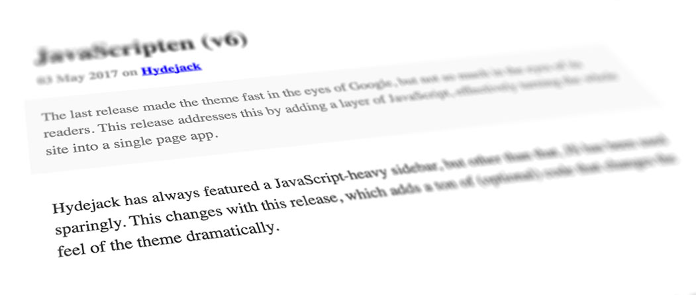

{:.lead}

## Usage
To use this flavor, make the following changes to following files:

### `_config.yml`

~~~yml
google_fonts: ''
font:         serif
font_heading: serif

accent_color: '#00e'
accent_image: /hydejack/assets/img/oldschool-bg.jpg

hydejack:
  no_google_fonts: true
~~~

### `_sass/my-inline.scss`

~~~css
.project-card, .project-card-image, .pagination-item > * {
  border-radius: 0!important;
}

code, pre {
  font-family: monospace!important;
}

blockquote {
  border-left: none!important;

  &.lead {
    padding-left: 2rem;
  }
}

.avatar {
  border-radius: 0;
}

a {
  border-bottom: none!important;
  text-decoration: underline!important;
}

.sidebar-social a, .menu {
  text-decoration: none!important;
}
~~~

***

## Attributions
* [Sun SparcStation 10 with CRT.jpg](https://commons.wikimedia.org/wiki/File:Sun_SparcStation_10_with_CRT.jpg)
  by Thomas Kaiser.
  License: [CC-BY-SA-3.0]. Changes: Sun logos removed, perspective distortion;
* [iPhone 6S Rose Gold.png](https://commons.wikimedia.org/wiki/File:IPhone_6S_Rose_Gold.png).
  License: [CC-BY-SA-3.0]. Changes: Desaturated;
* [iPad Air 2.png](https://commons.wikimedia.org/wiki/File:IPad_Air_2.png)
  by [Justinhu12](https://commons.wikimedia.org/wiki/User:Justinhu12).
  License: [CC-BY-SA-4.0]. Changes: Desaturated;
* [Mandel zoom 08 satellite antenna.jpg](https://commons.wikimedia.org/wiki/File:Mandel_zoom_08_satellite_antenna.jpg).
  License: [CC-BY-SA-3.0]. Changes: None;

Screenshots can be reused under [CC-BY-SA-4.0].

[CC-BY-SA-4.0]: https://creativecommons.org/licenses/by-sa/4.0/
[CC-BY-SA-3.0]: https://creativecommons.org/licenses/by-sa/3.0/
