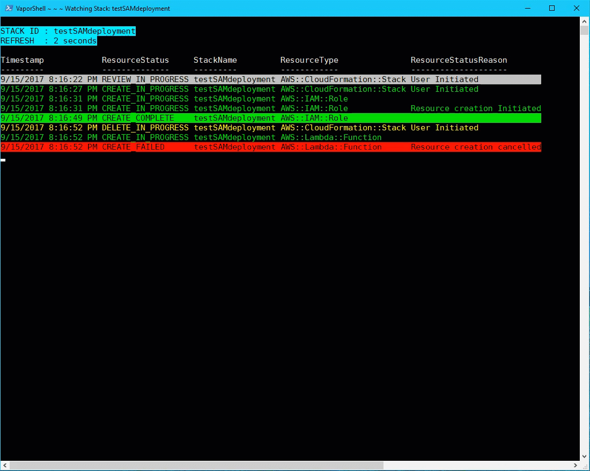
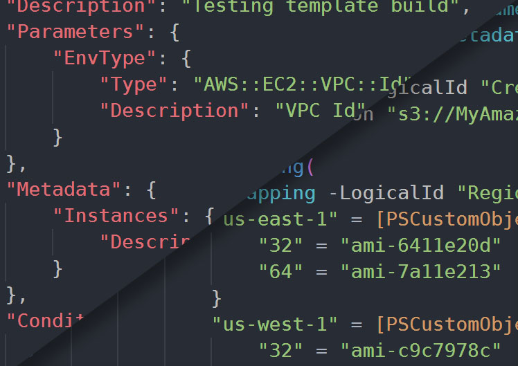

{:.lead}

{:.lead}

VaporShell was originally designed to leverage PowerShell to build CloudFormation templates. Since version 1.0.0, it has grown into a full-fledged CloudFormation management tool.

Here are some key features of VaporShell:
* Cross-platform support
  * VaporShell runs in PowerShell 3.0+ and in PowerShell Core. If you can run PowerShell, you can use VaporShell
* Full CloudFormation resource support
  * Functions dynamically built directly from AWS' own specification sheet
* Full Serverless Application Model support
  * Build your template with Serverless transforms, then package your code to S3 and deploy your updated template in one shot

